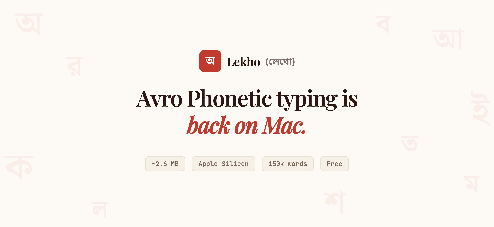

# Lekho (লেখো) — Avro Phonetic Bangla Keyboard for macOS

<div align="center">
  
</div>

**The only working native Avro Phonetic keyboard for modern macOS and Apple Silicon.**

Lekho brings Avro Phonetic-style Bangla (Bengali) typing back to the Mac — natively on Apple Silicon (M1, M2, M3, M4, M5). If you used Avro Keyboard on Windows, iAvro on older macOS, or OpenBangla Keyboard on Linux, Lekho is your Mac equivalent.

**[Download](https://github.com/ARahim3/Lekho/releases/latest)** | **[Website](https://arahim3.github.io/Lekho/)**

---

## Why Lekho?

Every existing Bangla keyboard option for macOS is either abandoned or broken on Apple Silicon:

- **Avro Keyboard** (OmicronLab) — discontinued for Mac
- **iAvro** — broken on modern macOS, not Apple Silicon native
- **OpenBangla Keyboard** — Linux only (Qt-based), no macOS port
- **macOS built-in Bengali** — Apple's own layout, not Avro phonetic

Lekho fills this gap. It's a native macOS input method that works in every app — Safari, Chrome, VS Code, Notes, Spotlight, everywhere.

## Features

- **Avro Phonetic typing** — type `ami banglay gan gai` → আমি বাংলায় গান গাই
- **150k word dictionary** with smart suggestions and autocorrect
- **Native Apple Silicon** — ~2.6 MB, instant startup, zero CPU when idle
- **Works on all Apple Silicon Macs** — MacBook Air, MacBook Pro, iMac, Mac Mini, Mac Studio (M1/M2/M3/M4/M5)
- **Works everywhere** — built with Apple's InputMethodKit framework
- **Completely offline** — no internet, no data collection, no telemetry
- **Free and open source** (MPL-2.0) — no ads, no subscription

## Install

1. Download the latest `.dmg` from [Releases](https://github.com/ARahim3/Lekho/releases/latest)
2. Open the DMG and double-click **Install Lekho.pkg**
   > **macOS may block the installer** since Lekho isn't signed with an Apple Developer ID yet. If that happens: go to **System Settings → Privacy & Security**, scroll to the bottom, and click **"Allow Anyway"** next to the Lekho message. Then try opening the .pkg again.
3. **⚠️ IMPORTANT:** Log out of your Mac and log back in. *(First time only — macOS requires this to discover new custom input methods).*
4. Go to **System Settings → Keyboard → Input Sources → Edit**, click **+**, find **Lekho**, and add it
5. Use Globe key or Ctrl+Space to switch to Bangla

## Requirements

- macOS 13 (Ventura) or later
- Apple Silicon Mac (M1/M2/M3/M4/M5)

## Build from Source

Prerequisites: Rust toolchain, Xcode (for Swift and InputMethodKit).

```bash
# Install Rust (if not already)
curl --proto '=https' --tlsv1.2 -sSf https://sh.rustup.rs | sh
rustup target add aarch64-apple-darwin

# Build
make build

# Install to ~/Library/Input Methods/
make install

# Create distributable .dmg
bash scripts/create_dmg.sh
```

## Architecture

```
Swift (InputMethodKit)  ←→  Rust Engine (riti) via C FFI
```

- **Rust engine** (`engine/`) — wraps [OpenBangla/riti](https://github.com/OpenBangla/riti), compiled as a static library
- **Swift IMK layer** (`Lekho/`) — subclasses `IMKInputController`, handles key events, candidate window, and text commits
- **No Xcode project** — built with `swiftc` + `cargo` + shell scripts

## Contributing

Contributions are highly welcome! Whether it's reporting a bug, suggesting a feature, or submitting a pull request to improve the Swift or Rust codebases, feel free to get involved.


## Credits

Lekho is powered by [OpenBangla's riti engine](https://github.com/OpenBangla/riti) — the same Bengali transliteration engine behind [OpenBangla Keyboard](https://github.com/OpenBangla/OpenBangla-Keyboard) on Linux.

## Feedback

Found a bug or have a suggestion? [Open an issue](https://github.com/ARahim3/Lekho/issues).

## License

[MPL-2.0](LICENSE)

---

**Keywords:** Avro keyboard Mac, Bangla keyboard macOS, Bengali typing MacBook, Avro phonetic Apple Silicon, অভ্র কিবোর্ড ম্যাক, বাংলা টাইপিং ম্যাক

Maintained by [Abdur Rahim](https://github.com/ARahim3)
