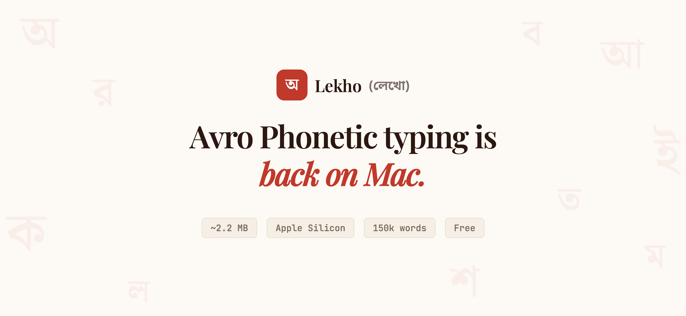
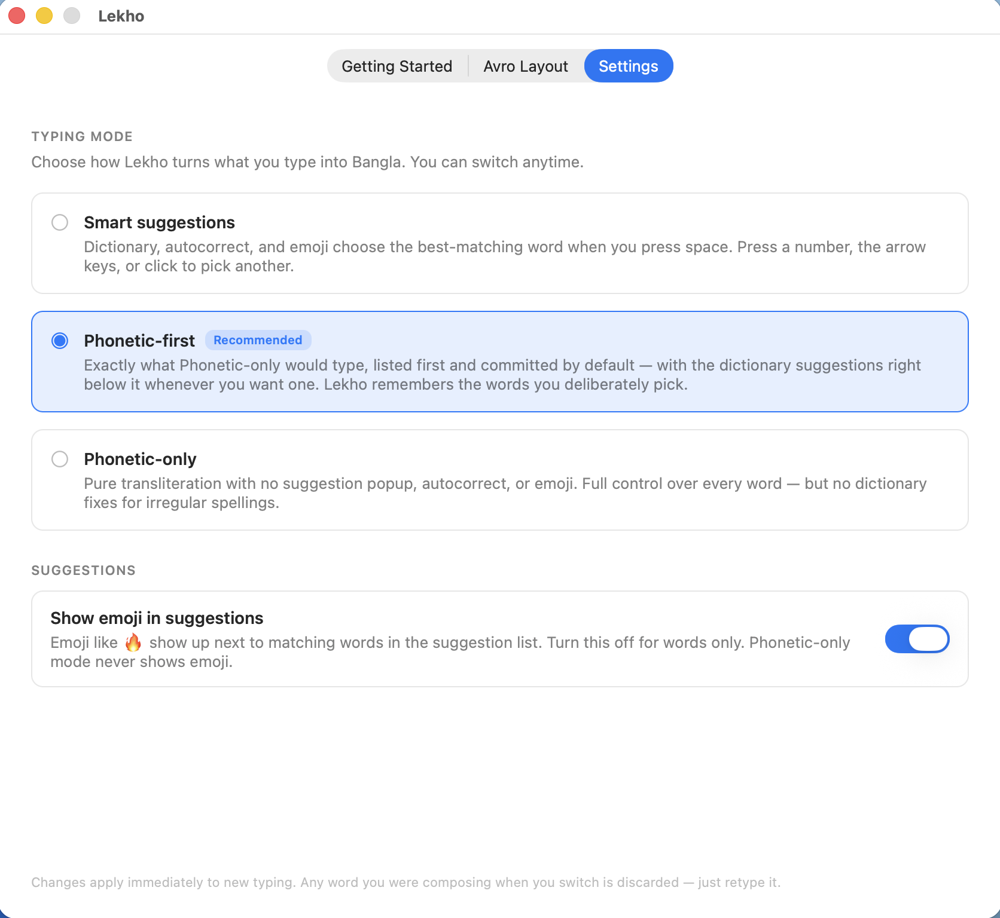
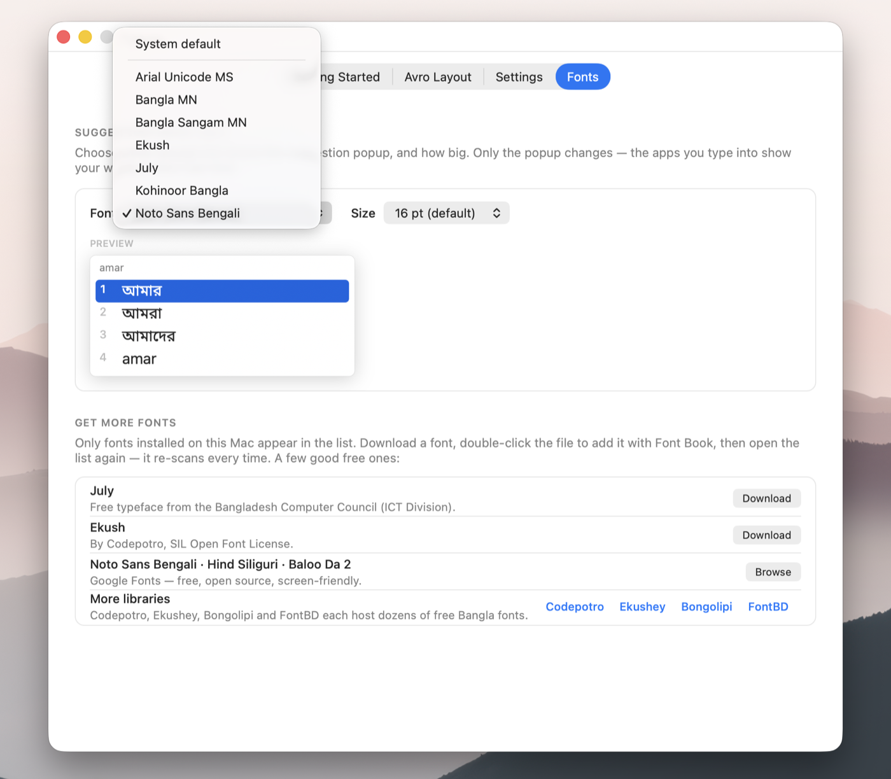

# Lekho (লেখো) — Avro Phonetic Bangla Keyboard for macOS

<div align="center">
  
</div>

<p align="center">
  <a href="https://github.com/ARahim3/Lekho/releases/latest"></a>
  <a href="https://github.com/ARahim3/Lekho/releases"></a>
  <a href="https://github.com/ARahim3/Lekho/stargazers"></a>
  
  <a href="./LICENSE"></a>
</p>

**The only Avro Phonetic keyboard built natively for Apple Silicon Macs.**

Lekho brings Avro Phonetic-style Bangla (Bengali) typing to Apple Silicon Macs natively (M1, M2, M3, M4, M5) — no Rosetta required. If you used Avro Keyboard on Windows, iAvro on macOS, or OpenBangla Keyboard on Linux, Lekho is your native Apple Silicon alternative.

**[Download](https://github.com/ARahim3/Lekho/releases/latest)** | **[Website](https://arahim3.github.io/Lekho/)**

---

## Why Lekho?

The existing Bangla keyboard options for macOS each have limitations on Apple Silicon:

- **Avro Keyboard** (OmicronLab) — Windows-focused, no native macOS build
- **iAvro** — Intel-only macOS build that runs on Apple Silicon through Rosetta. [Apple has announced](https://support.apple.com/en-us/102527) Rosetta support is being wound down — fully available in macOS 27, then limited to legacy games starting in macOS 28. macOS already shows a deprecation warning on Intel-only input methods.
- **OpenBangla Keyboard** — Linux only (Qt-based), no macOS port
- **macOS built-in Bengali** — Apple's own layout, not Avro phonetic

Lekho is built natively for Apple Silicon — no Rosetta required, future-proof as macOS evolves. It works in every app — Safari, Chrome, VS Code, Notes, Spotlight, everywhere.

## Features

- **Avro Phonetic typing** — type `ami banglay gan gai` → আমি বাংলায় গান গাই
- **150k word dictionary** with smart suggestions and autocorrect
- **Smart emoji suggestions** — type কান্না and get 😢, বাংলাদেশ and get 🇧🇩, right in the candidate panel
- **Three typing modes** — *Phonetic-first* (default: your exact spelling by default with the suggestion list still one keypress away), *Smart* (suggestions, autocorrect, and emoji pick the word for you), or *Phonetic-only* (pure character-by-character control, no popup). Switch anytime in Settings.
- **Your font, your size** — draw the suggestion popup in any installed Bangla font (July, Ekush, Noto Sans Bengali, …) at the size you like. Nothing bundled, so the app stays tiny.
- **Native Apple Silicon** — ~2.2 MB, instant startup, zero CPU when idle
- **Works on all Apple Silicon Macs** — MacBook Air, MacBook Pro, iMac, Mac Mini, Mac Studio (M1/M2/M3/M4/M5)
- **Works everywhere** — built with Apple's InputMethodKit framework
- **Completely offline** — no internet, no data collection, no telemetry
- **Signed and notarized** — signed with an Apple Developer ID and notarized by Apple, so it installs like any other Mac app, no security warnings
- **Free and open source** (MPL-2.0) — no ads, no subscription

## Install

### Option A — Download the DMG (recommended)

1. Download the latest `.dmg` from [Releases](https://github.com/ARahim3/Lekho/releases/latest) (on an Intel Mac or macOS 11–12, take the `-Universal.dmg`; see [Requirements](#requirements))
2. Open the DMG and double-click **Install Lekho.pkg**

   > Since v0.3.2, Lekho is signed with an Apple Developer ID and notarized by Apple, so the installer opens without any security warning. If you see *"Install Lekho.pkg" Not Opened*, you have an older download — grab the latest one.

To update later, download the new DMG and run the installer again. No log out needed.

### Option B — Homebrew

```sh
brew install --cask arahim3/lekho/lekho
```

That single command auto-taps and installs Lekho. Then jump to **step 3** below to add the input source.

To update later: `brew upgrade --cask lekho`. To uninstall: `brew uninstall --cask lekho`.

> **After `brew upgrade`, Lekho may disappear from the input menu.** Homebrew removes the old app a few seconds before it installs the new one, and macOS takes Lekho off the menu in the meantime. To bring it back, open **System Settings → Keyboard → Input Sources → Edit**, remove Lekho with **−**, and add it again with **+**. Your settings and learned words are kept. Updating with the DMG installer doesn't cause this.

### Final steps (both options)

3. Go to **System Settings → Keyboard → Input Sources → Edit**, click **+**, find **Lekho**, and add it
   > If Lekho doesn't appear in the list, log out of your Mac and log back in — macOS sometimes needs this to discover new input methods on first install.
4. Use Globe key or Ctrl+Space to switch to Bangla

## Typing modes

Open the **Settings** tab in the Lekho window to pick how typing behaves:

<p align="center">
  
</p>

- **Phonetic-first** *(default)* — your exact phonetic spelling is committed by default, but the suggestion list is still one keypress away. Lekho remembers the words you deliberately pick.
- **Smart suggestions** — dictionary, autocorrect, and emoji pick the best-matching word when you press space.
- **Phonetic-only** — pure transliteration, no suggestion popup, autocorrect, or emoji.

Prefer suggestions without emoji? Turn off **Show emoji in suggestions** in the same tab.

Changes apply immediately — no restart needed.

## Fonts

<p align="center">
  
</p>

The **Fonts** tab lets you pick which installed Bangla font draws the suggestion popup, and how big. Only the popup changes — apps show the words you type in their own font. Only fonts installed on your Mac are listed; the tab links to a few good free ones (July, Ekush, Google's Noto Sans Bengali) and re-scans every time you open the list.

## Requirements

- macOS 13 (Ventura) or later
- Apple Silicon Mac (M1/M2/M3/M4/M5)

**Intel Mac, or macOS 11–12?** Each release also has a Universal DMG (`Lekho-X.Y.Z-Universal.dmg`) that runs on Intel Macs and on macOS 11 (Big Sur) or later. It's newer and less tested than the Apple Silicon build, so please [open an issue](https://github.com/ARahim3/Lekho/issues) if anything misbehaves. Homebrew installs the Apple Silicon build only.

## Build from Source

Prerequisites: Rust toolchain, Xcode (for Swift and InputMethodKit).

```bash
# Install Rust (if not already)
curl --proto '=https' --tlsv1.2 -sSf https://sh.rustup.rs | sh
rustup target add aarch64-apple-darwin

# Build
make build

# Install to ~/Library/Input Methods/
make install

# Create distributable .dmg
bash scripts/create_dmg.sh
```

For the Universal build (Intel + Apple Silicon, macOS 11+), add `rustup target add x86_64-apple-darwin` and use `make build-universal`; it needs the full Xcode app, not just the Command Line Tools. `create_dmg.sh` then names the result `Lekho-X.Y.Z-Universal.dmg`.

Local builds are ad-hoc signed and work fine on your own Mac. Official releases are signed with a Developer ID and notarized; the scripts only do that when those certificates are in your keychain.

## Architecture

```
Swift (InputMethodKit)  ←→  Rust Engine (riti) via C FFI
```

- **Rust engine** (`engine/`) — wraps [OpenBangla/riti](https://github.com/OpenBangla/riti), compiled as a static library
- **Swift IMK layer** (`Lekho/`) — subclasses `IMKInputController`, handles key events, candidate window, and text commits
- **No Xcode project** — built with `swiftc` + `cargo` + shell scripts

## Contributing

Contributions are highly welcome! Whether it's reporting a bug, suggesting a feature, or submitting a pull request to improve the Swift or Rust codebases, feel free to get involved.

For anything bigger than a small bug fix, please open an issue before writing code — see [CONTRIBUTING.md](CONTRIBUTING.md).


## Credits

Lekho is powered by [OpenBangla's riti engine](https://github.com/OpenBangla/riti) — the same Bengali transliteration engine behind [OpenBangla Keyboard](https://github.com/OpenBangla/OpenBangla-Keyboard) on Linux.

## Feedback

Found a bug or have a suggestion? [Open an issue](https://github.com/ARahim3/Lekho/issues).

## License

[MPL-2.0](LICENSE)

---

**Keywords:** Avro keyboard Mac, Bangla keyboard macOS, Bengali typing MacBook, Avro phonetic Apple Silicon, অভ্র কিবোর্ড ম্যাক, বাংলা টাইপিং ম্যাক

Maintained by [Abdur Rahim](https://github.com/ARahim3)
